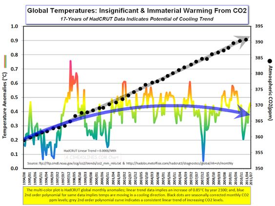

# Self Study Project
### MSIS 2629 Data Visualization - Self Study Project

## Data Visualization

The concept of using pictures to understand data has been around for centuries, from maps and graphs in the 17th century to the invention of the pie chart in the early 1800s. Data visualization is the graphical display of abstract information for two purposes: sense-making and communication.

As the saying goes, 
> "a picture is worth a thousand words" 

often more - but only when the story is best told graphically rather than verbally and the picture is well designed.

## Part 1
### 5 different visualizations of Climate change 

#### Visualization 1 [link][1]

#### Visualization 2 [link][2]

#### Visualization 3 [link][3]

#### Visualization 4 [link][4]

#### Visualization 5 [link][5]

### Visualization Review, Comparison and Contrast

| | Visualization-1 | Visualization-2 | Visualization-3 | Visualization-4 | Visualization-5
 ----- | ------ | ------ | ------ | ------ | ------
**Purpose of Visualization** | To show the trend of Global annual mean surface temperature from 1850- 2010. | To show the trend of Global temperature from 1850- 2016 with the help of colors in polka dots. | To show the trend of Global temperature from 1850- 2016 with the help of spiral. | To show that natural sun fluctuations cause global warmimg. It shows that the temperature pattern coincides with the solar activity. | To show that carbon dioxide emmission is not the main cause for global temperature increase.
**Is the design aesthetically pleasing?** | Yes	| Not much | Yes | Yes, it is. But could be better. | No. The values on x-axis look quite congested and is not readable.
**Is it immediately understandable?** | Yes	| It takes few minutes to understand. | Yes	 | No. It takes time to understand the graph. | No. It takes some time to understand the graph.
**Does it provide insight or understanding better than the alternate visualization?** | This graph succesfully shows that the annual mean temperature has increased from 1850-2010 but major insight like the cause of temperature change is missing. | This graph succesfully shows that the annual mean temperature has increased from 1850-2016 but major insight like the cause of temperature change is missing. | This graph succesfully shows that the annual mean temperature has increased from 1850-2016 but major insight like the cause of temperature change is missing. | Yes, the content of the graph is good. The insight generated by the graph is also clear. | This graph serves the purpose well and the insight is quite clear but the design of the graph could be better.
**What kind of visualization might have been better?**	 | A visualization that could also tell the reason for this temperature increase would have been better. | A visualization that could also tell the reason for this temperature increase would have been better. | A visualization that could also tell the reason for this temperature increase would have been better. | This is good | Improvement in x-axis data would be better. Plus, the graph shows that carbon dioxide is not the main cause for temperature increase but doesn’t show what is the cause.
**Does the visualization reveal a trend/pattern for the reviewer to make effective comparison?** | Yes, it shows the trend of temperature from 1850-2010. | Yes, it shows the trend of temperature from 1850-2016. | Yes, it shows the trend of temperature from 1850-2016. | Yes | Yes, it does.
**Does the visualization successfully highlight important information, while providing context for that information?** | Yes, it does. But it doesn’t show the reason for climate change. Only after reading the article related to this graph tells us that this change is because of human activities. | The graph just shows that there is an increase in global temperature over the years but there is no interesting insight. | The graph just shows that there is an increase in global temperature over the years but there is no interesting insight. | Yes | Yes
**Does it distort the information?** | No | No | No | No | No
**Does it omit important information?** | Yes (reason for climate change) | Yes (reason for climate change) | Yes (reason for climate change) |	No | Not really. But information on the cause of the temperature change could be included.
**Is it memorable?** | The outcome of the graph will be well imprinted in one's mind. | Yes. The outcome of the graph will remain in one's mind. | Yes. The outcome of the graph will remain in one's mind. | The pattern stays in mind. | The outcome of the graph stays in mind.
**Does it use visuals properly (line, colors etc)?** | Yes | The colors are too dark. The text written inside is not properly readable. | Yes, the visuals are proper and easily understandable. | Yes, it does. | The readings on x-axis can be improved. The temperature anamoly is also explained but could be written in a better way.
**Does it use labels and legends properly?** | Yes | Yes	| Yes |	Yes | Congested x-axis.

### Overall Assessment
While searching for the graphs, there were a lot of visualizations on the climate of the current year, but not necessarily a trend over the years which could explain the change. The five shortlisted visualizations showed a change in climate over many years. Three of them displayed an increase in temperature over the years.

Although, an important fact but they did not cover the cause of the increase. Also, one of the graphs showed that carbon dioxide is not the main cause of global warming but again skipped the reason for global warmimg. This research helped in understanding the role of visualization in understanding data. Its very important for the visualization to be easy to understand and it should also add more value as compared to the text associated with it. In many cases, it was noticed that the cause of increase was explained in the text at length but not visualized. Proper colors in the graph is also important.

### Conclusion
* Good data visualizations come in all shapes and sizes, but all have certain characteristics that help ensure that you produce something with important insights.
* A good data visualization piece should be meaningful, desirable and usable.

## Part 2

### Replicated climate change warming stripes

## References
[1]: http://reg.bom.gov.au/cgi-bin/climate/change/global/timeseries.cgi
[2]: https://www.climate-lab-book.ac.uk/2017/polka-dot-patterns/#more-5115
[3]: https://www.climate-lab-book.ac.uk/spirals/
[4]: https://climatechange.procon.org/view.resource.php?resourceID=003801
[5]: https://wattsupwiththat.com/2011/09/14/24-hours-of-climate-reality-gore-a-thon-hour-7/

* [5 Characteristics All Excellent Data Visualization Should Have](https://ecmapping.com/2016/05/17/5-characteristics-all-excellent-data-visualization-should-have/)
* [Data Visualization for Human Perception](https://www.interaction-design.org/literature/book/the-encyclopedia-of-human-computer-interaction-2nd-ed/data-visualization-for-human-perception)
* [Data Visualization: What it is and why it matters](https://www.sas.com/en_us/insights/big-data/data-visualization.html)
* [14-evaluating-visualizations](https://www.coursera.org/lecture/data-results/14-evaluating-visualizations-IBuU3)
